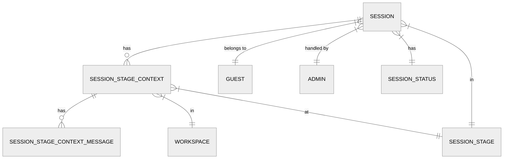

AWS Lambda is a serverless compute service that runs your code in response to events.

## Key Concepts

- **Functions**: Your code packaged as a Lambda function
- **Triggers**: Events that invoke your function
- **Runtime**: The execution environment for your code

## Common Use Cases

- API endpoints
- Data processing
- Scheduled tasks
- Event-driven architectures

## Pricing

You only pay for the compute time you use, measured in 100ms increments.

