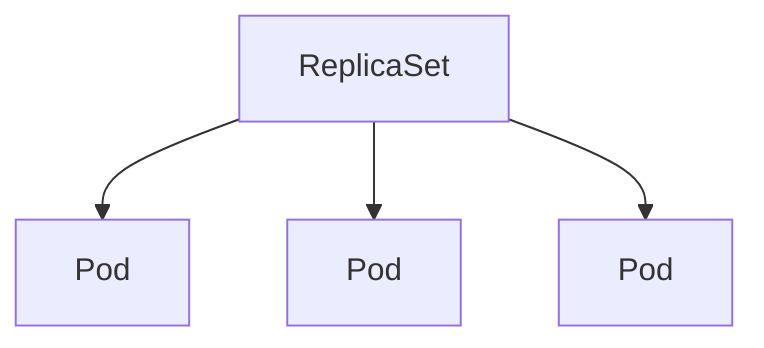
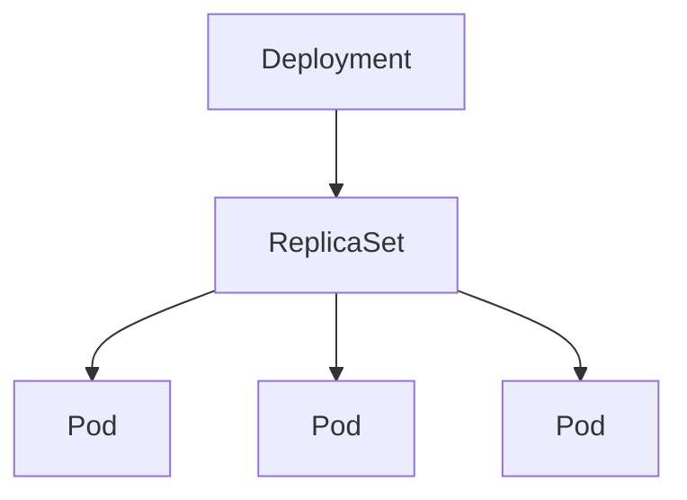

## Definition

Kubernetes is a container orchestration technology (comparable to Docker Swarm and Mesos from Apache). It helps ensure that apps run reliably across different environments by managing resources like computing, storage, and networking.

## Kubernetes Concepts

As previously stated, it goal of kubernetes is container orchestration, allowing a deployed package to be highly available as hardware failures do not bring your application down.
The traffic is load balanced across the various containers and when demand increases more instances can be deployed seamlessly.

### Container Runtimes

Kubernetes supports multiple container environments which supports the **Container Runtime Interface** (CRI) or through **dockershim** in case of Docker (a separate compatibility layer not CRI compliant).

### Components of Kubernetes

- API Server, etcd, kubelet, container runtime, controller, scheduler

#### Node

A **Node** (Minion) is a worker machine (either physical or virtual) in Kubernetes.

There are 2 types of nodes:

- A Master Node (Control Plane Node)
- A Worker Node

##### Master Node

A **Master Node** is a node which has the role of managing a kubernetes cluster and scheduling workloads on worker nodes.

Components:

- kube-apiserver: acts a restful api server that serves as the main entry point to the Kubernetes cluster and handling all administrative operations.
- etcd: a distributed key-value store used by kubernetes to store all cluster data (configuration, desired and actual state of the cluster, metadata).
- controller: a control loop that ensure the actual state of the cluster matches the desired state (noticing when containers / nodes goes down and correcting the state).
- scheduler: responsible for placing pods onto suitable nodes in the cluster.

How they work together:

```text
etcd:
  Stores all cluster state information.
  Acts as the central database for Kubernetes.

Controllers:
    Monitor the cluster state through the kube-apiserver and ensure the cluster operates as desired by taking corrective actions.

Scheduler:
    Ensures that Pods are placed on the right Nodes based on resource availability and constraints.
```

##### Worker Node

A **Worker Node** is responsible for running containers withing Pods and providing the resources (CPU, memory, storage and networking) that those workloads need.
Furthermore, it is managed by the Master Node.

Components:

- kubelet: an agent running on each worker node, that communicates with kube-apiserver on the master node and ensures that containers described in the Pod specs are running as expected on the node (continuanly monitoring the health of the pods and reporting the status to the master node).
- Container Runtime: the software responsible for running the container (e.g.: Docker)
- kube-proxy: a network proxy that manages network rules on each worker node, ensuring that pods can communicate with each other and with external clients

#### Cluster

A **Cluster** is a set of nodes grouped together.

#### Pods

A **Pod** in Kubernetes is the smallest and most basic deployable unit, representing a single instance of a running process in a Kubernetes cluster.
It can hold one or more containers (usually Docker containers) that will share the following:

- Network namespace
- Storage volumes
- Lifecycle

**Pods** are scaled / down-scaled by creating new ones or removing them in their entirety (this includes all the container running inside of them).

- [Pod Example](assets/pod-example.yaml)

#### Replicas



##### ReplicaSets

A ReplicaSet's purpose is to maintain a stable set of replica Pods running at any given time.
It is composed of:

- A selector that specifies how to identify pods it can acquire
- The number of replicas
- The pod template specification

Afterward the ReplicaSet scales or downscales pods to reach its desired number.

- [ReplicaSet Example](assets/replicaset-example.yaml)

##### Replication Controller (deprecated)

Legacy API for managing workloads that can scale horizontally. Superseded by the Deployment and ReplicaSet APIs.

#### Deployments

A Deployment is a higher-level concept that manages ReplicaSets to run an application workload. It provides declarative updates for Pods and ReplicaSets.
You describe a desired state in a Deployment, and the Deployment Controller changes the actual state to the desired state at a controlled rate.



- [Deployment Example](assets/deployment-example.yaml)

##### Rollout and Versioning

Deployment Strategies:

- Recreate: all existing Pods are terminated before new ones are created.
- Rollover (`RollingUpdate`): Pods are gradually replaced while keeping the application available.

Deployment status:

- Progressing: a new ReplicaSet is being created or scaled.
- Complete: all replicas were updated and are available.
- Failed: the Deployment did not progress before its deadline.

Updating a deployment:

Changes to the Pod template, such as a new container image, trigger a rollout and create a new ReplicaSet.

Revision Management:

Each rollout creates a revision. Previous revisions can be inspected and used to roll back the Deployment.

```sh
kubectl set image deployment/<name> <container>=<image>:<tag>
kubectl rollout status deployment/<name>
kubectl rollout history deployment/<name>
kubectl rollout undo deployment/<name>
```

> **Insight:** Deployments do not update Pods in place. They create a new ReplicaSet and gradually replace the old Pods. During a `RollingUpdate`, `maxSurge` limits extra Pods and `maxUnavailable` limits how many Pods may be unavailable.

#### Services

A Service provides a stable network endpoint for a group of Pods. It selects Pods by their labels and forwards traffic to them, allowing clients to reach an application without knowing its temporary Pod IPs.

Service Types:

- NodePort: exposes the Service through a port on every Node.
- ClusterIP: exposes the Service only inside the cluster. This is the default type.
- LoadBalancer: exposes the Service through an external load balancer when supported by the infrastructure.

Services match a set of Pods using labels and selectors, a grouping primitive that allows logical operation on objects in Kubernetes

##### NodePort

A NodePort exposes the Service on the same static port of every Node. It is useful for simple external access during development or when an external load balancer is not available.

- [NodePort Example](assets/notes/iac/nodeport-example.yaml)

##### ClusterIP

A ClusterIP exposes the Service only inside the cluster. It is useful for communication between internal applications, such as a frontend connecting to a backend.

- [ClusterIP Example](assets/notes/iac/clusterip-example.yaml)

##### LoadBalancer

A LoadBalancer exposes the Service outside the cluster by requesting a load balancer from the underlying infrastructure. It is commonly used with cloud integrations such as AWS EKS or Azure AKS for public applications that need a single external entry point.

- [LoadBalancer Example](assets/notes/iac/loadbalancer-example.yaml)

#### Ingress

An Ingress manages HTTP and HTTPS traffic entering the cluster and routes it to Services based on hostnames or URL paths. For example, `example.com/api` can route to an API Service while `example.com/web` routes to a frontend Service.

Unlike a NodePort, which exposes a static port on every Node, an Ingress provides a single entry point for multiple web applications and can centralize TLS termination. It commonly routes traffic to ClusterIP Services, which then forward it to the matching Pods.

An Ingress resource only defines the routing rules. An Ingress Controller, such as NGINX Ingress Controller or Traefik, must be installed in the cluster to enforce them.

It is useful when applications need domain-based or path-based routing and HTTPS access without exposing each Service separately.

#### Networking

Each Pod receives its own cluster IP address. Pods can communicate directly with other Pods, including across Nodes. Pod IPs are temporary and can change when Pods are replaced.

Containers inside the same Pod share the Pod IP, network interfaces and port space. They communicate with each other through `localhost`.

The Kubernetes networking model is implemented by a Container Network Interface (CNI) plugin such as Calico, Cilium or Flannel.

##### DNS

CoreDNS provides DNS-based service discovery inside the cluster. Pods normally reach a Service by name instead of its IP address.

```text
<service>.<namespace>.svc.cluster.local
```

Within the same namespace, the Service name alone can be used.

##### NetworkPolicies

NetworkPolicies control traffic entering (`ingress`) and leaving (`egress`) selected Pods. They can restrict communication by Pod, namespace, protocol and port.

They are enforced only when supported by the installed CNI plugin. Without restrictive policies, Pod traffic is commonly allowed by default.

#### Volumes

- https://kubernetes.io/docs/concepts/storage/volumes/

#### Kustomize

Kustomize is a configuration management tool built into `kubectl`. It customizes Kubernetes manifests without modifying the original YAML files or using templates.

A `kustomization.yaml` file lists the resources to include and the changes to apply. A common structure uses a reusable `base` configuration and `overlays` for environment-specific changes such as development or production.

```text
base/
  deployment.yaml
  service.yaml
  kustomization.yaml
overlays/
  development/
    kustomization.yaml
  production/
    kustomization.yaml
```

Render or apply a Kustomize configuration:

```sh
kubectl kustomize <directory>
kubectl apply -k <directory>
```

It is useful when the same application is deployed to multiple environments with small differences, such as image tags, replica counts, namespaces or labels.

## Manifest File

A Kubernetes **Manifest File** is a YAML (or JSON) configuration file used to define the desired state of Kubernetes objects such as Pods, Deployments, Services, ConfigMaps, and more.

```yaml
apiVersion: v1 # Specifies the API version of the Kubernetes object
kind: <Pod / Deployment / Service / ConfigMap / Ingress> # Specifies the type of Kubernetes object to create (e.g: Pod, Deployment, Service)
metadata: # Provides metadata about the object such as its name, namespace, labels and annotations
  name: nginx # Unique name for the object within its namespace.
  namespace: production # (Optional) Namespace where the object resides (default is default).
  labels: # Key-value pairs to categorize and identify objects.
    app: nginx
    tier: frontend
  annotations: # Key-value pairs for additional metadata.
    description: 'This deployment runs the frontend application.'
spec: # Defines the desired state or configuration of the object.
  containers: # For Pods
    - name: nginx
      image: nginx
```

For the spec part, contents vary depending on the object type:

- Deployment: Includes replicas, selector, and template.
- Pod: Includes containers, volumes, and restartPolicy.
- Service: Includes type, selector, and ports.

More examples can be found here:

- [Pod Example](assets/pod-example.yaml)
- [Config Map Example](assets/configmap-example.yaml)
- [Service Example](assets/service-example.yaml)
- [Ingress Example](assets/ingress-example.yaml)

### Best Practices:

#### YAML

- Use space instead of tabs, since the tab character is illegal withing yaml files.
- Quote string where necessary
- Use pipe (|) for multiline string
  ```yaml
  data:
    long-config: |
      This is a multiline string.
      Each line is preserved as-is.
  ```
- Avoid trailing whitespaces

## Command Line Utilities

There are several command line utilities available for use in kubernetes:

- kubectl: the primary command-line tool for interacting with the Kubernetes cluster, allowing you to communicate with the Kubernetes API server to manage resources and workloads
- ctr: a CLI provided by Containerd for interacting directly with the Containerd daemon. Primarly used as a debugging tool to manage container images, containers and namespaces directly at Containerd layer
- nerdctl: the docker compatible CLI for Containerd, providing commands similar to docker's cli but interacts directly with Containerd under the hood.
- crictl: a CLI for interacting with container runtimes that implement Kubernetes CRI (such as Containerd or CRI-O). Used to inspect and debug container runtimes (not ideal to create containers ideally), works across different runtimes.

### Useful Commands

#### Kubectl

- Create a NGINX Pod
  ```shell
  kubectl run nginx --image=nginx
  ```
- Create a deployment using imperative command
  ```shell
  kubectl create deployment nginx --image=nginx
  ```
- List all pods in the namespace
  ```shell
  kubectl get pods
  ```
- List relevant data in the namespace
  ```shell
  kubectl get all
  ```
- List all pods in a specific namespace
  ```shell
  kubectl get pods -n <namespace>
  ```
- Describe a specific pod
  ```shell
  kubectl describe pod <pod-name> -n <namespace>
  ```
- Apply a configuration file
  ```shell
  kubectl apply -f <file.yaml>
  ```
- Delete a resource
  ```shell
  kubectl delete <resource> <name> -n <namespace>
  ```
- Execute a command inside a pod
  ```shell
  kubectl exec -it <pod-name> -n <namespace> -- <command>
  ```
- Apply for all configuration inside the current folder
  ```shell
  kubectl apply -f .
  ```
- Delete for all configuration inside the current folder
  ```shell
  kubectl delete -f .
  ```
- See what `kubectl apply` currently thinks was last applied:
  ```shell
  kubectl apply view-last-applied deployment/nginx
  ```

##### Managing deployments

- How to see Deployments
  ```shell
  kubectl get deployments
  ```
- Trigger a rollout by hand (<deployment-resource-name>=nginx)
  ```shell
  kubectl set image deployment/nginx nginx=nginx:1.27
  ```
- See rollout status:
  ```shell
  kubectl rollout status deployment/<deployment-resource-name>
  ```
- See rollout history:
  ```shell
  kubectl rollout history deployment/<deployment-resource-name>
  ```
- Undo a deployment:
  ```shell
  kubectl rollout undo deployment/<deployment-resource-name>
  ```
- Undo a deployment to a specific revision:
  ```shell
  kubectl rollout undo deployment/<deployment-resource-name> --to-revision=<revision-number>
  ```
- How to scale a deployment ReplicaSet:
  ```shell
  kubectl scale deployment <deployment-resource-name> --replicas=5
  ```

#### CTR

- List running containers
  ```shell
  ctr containers list
  ```
- List available images
  ```shell
  ctr images list
  ```
- Pull an image
  ```shell
  ctr images pull <image>
  ```
- Run a container

  ```shell
  ctr run <image> <container-name
  ```

  ```

  ```

#### NERDCTL

- List containers
  ```shell
  nerdctl ps
  ```
- Run a container:
  ```shell
  nerdctl run -d --name <container-name> <image>
  ```
- Pull an image
  ```shell
  ctr images pull <image>
  ```
- Run a container
  ```shell
  ctr run <image> <container-name
  ```
